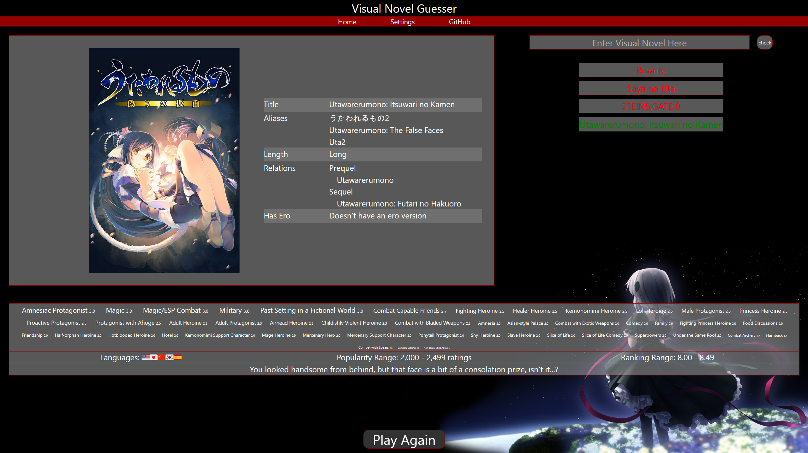
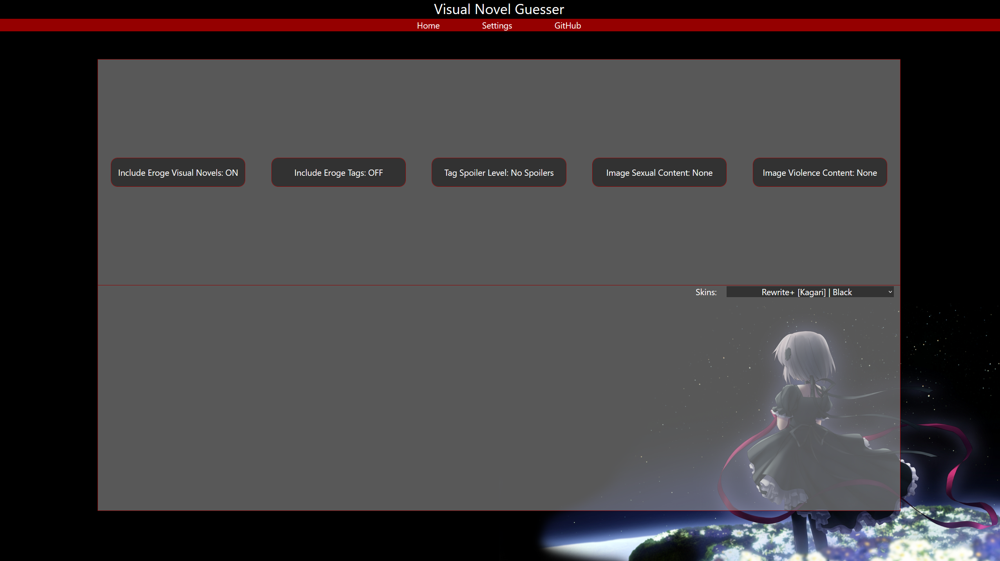
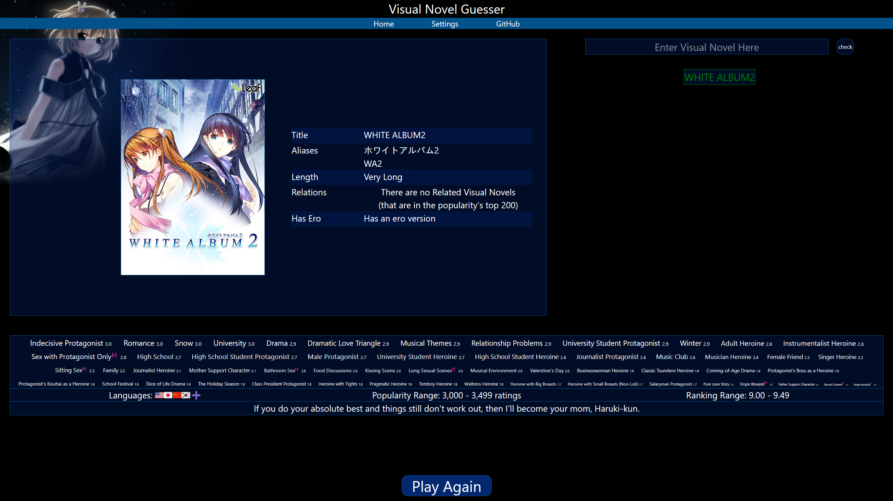

# Visual Novel Guesser

[Play here](https://pengool123.github.io/Visual-Novel-Guesser/) 

 
Guess the visual novel based on the hints given and tag overlaps from guessed visual novels. 

7 total tries per game 
- It will first give 5 random tags to start off 
 
Hint 1 - Available languages 
Hint 2 - The popularity range 
Hint 3 - The ranking range 
Hint 4 - Best quote if available, rough length, and if there is an Eroge version 
Hint 5 - A blurred image of the title 
One more guess is given after the last hint 

 
Note: the VNDB API's length isn't fully accurate compared to what's shown on the website 
Example: Katawa Shoujo shows as 'Long' on the website, but the API deems is 'Medium' 
 

## Features

- Include Eroge visual novels or not
- Include Eroge tags
- Change the spoiler level of what tags will and wont be shown
- Unblur the image even if it's sexual or explicit depending on settings
- Unblur the image even if it's violent or brutal depending on settings

A total of TWO WHOLE SKINS 
- Rewrite with Kagari | themed black
- Angelic Serenade with Lasty Darson | themed deep blue (vndb default look)

Okay~ Shake it now, baby now~♪